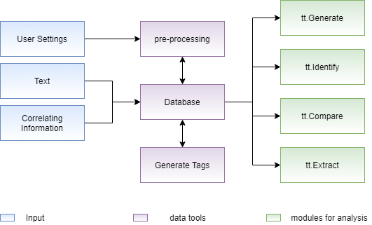
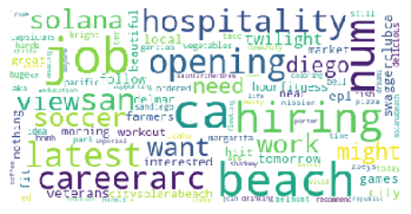

Welcome to Text Tagger's documentation!
=======================================

A module to analyze texts according to their characteristics, or tags. This module consists of a toll box that facilitates resource text management in order to make NLP as accessible to the user as modules such as Scikit-Learn and Tensorflow become for Machine Learning.

Model Pipeline
==================
==================

This module is structured in three layers:

In the first layer, the information entered by the user is obtained, which represents texts, information to 
correlate (tags) and desired settings. In possession of this data, the second layer, performs a pre-processing 
according to the data structure necessary for the NLP analysis modules, storing them in a structure called 
database, with the configured database it is possible to use different analysis modules in the last layer.

Submodules
==================
==================

Generate
==================

According to a tag and an initial text, it completes that text with words that can form a common sense phrase 
within the context of the selected tag. The operation of this module consists of, through a simple reccorent 
network, which uses a sequential model with layers of embedding, bidirectional LSTM and dense, calculates the 
words most likely to complete a sequence of previous words.

>>> generate = tt.Generate(database)  
>>> generate.train(tag, tag_column)  
>>> generate.generate("I love ")  
I love it when i stopped by my favorite coffeespot northendcoffeehouse yumaaz yumaarizona yuma

Compare
==================

Calculates the similarity between two tags, this module uses methods to calculate the distance between the 
embeddings of the selected tags, such as the cosine method that calculates the distance between the centroid 
of both embeddings and the jaccard method that calculates this distance by dividing the intersection of both 
embeddings by the union of these. The distance values, considered as similarity, are values ​​that belong to the 
range from zero to one, in which the closer to zero the less the similarity and the closer to one the greater the 
similarity.

>>> compare = tt.Compare(database)  
>>> compare.get_similarity(tag1, tag2,  tag_column1, tag_column2)
similarity: 0.8

Extract
==================

based on a database and a specific tag the  module aims to give the user a overview of what the texts in that tag are about and how the information present in them is treated.

To give an idea on tag content some of the functions on the extract module are:
   - get the most important words in the tag using different word frequency methods (PMI, NPMI)
   - get the most relevant tags in the tag by using clustering and different embedings (tf-idf, cbow, doc2vec, lda)
   - get the word cloud of the documents in the tag
   - get the lda topics that would be created with the documents in the tag

>>> extract = tt.Extract(database)  
>>> extract.get_wordcloud(tag, tag_colum)  

To allow the user to understand the relations between the topics in the tag some functions are:
   - make analogies of words by using word2vec embeding
   - find the most similar word to another word

>>> extract = tt.Extract(database)
>>> extract.make_analogy(tag, tag_column, relation=["boat", "car"], target="river") 
Road

With this functions the user can explore some specific properties of a slice of the dataframe and understand what it talks about in a visual way

Identify
==================

Based on a database and a input text this module will find the closest text in the database to the inputed 
text, and assume, since they are very similar that the tags should be the same. This proccess uses a embeding 
method to compare the vectors generated and compare the distance between the texts. The embedings method can 
vary between  (tf-idf, cbow, doc2vec, lda), and the number of searches to be made (number of similar texts to 
llok for) can be seted by the user

>>> identify = tt.Identify(database)
>>> identify.identify(["When life gives you lemons, make a lemonade"])
Tag_1 = 0, Tag_2 = 35

.. toctree::
   :maxdepth: 2
   :caption: Contents:

   modules/text_tagger

Indices and tables
==================

* :ref:`genindex`
* :ref:`modindex`
* :ref:`search`
